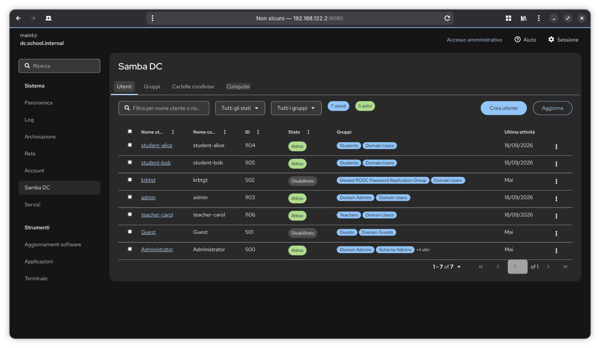

# cockpit-samba-ad-dc

[](https://github.com/lineadicomando/cockpit-samba-ad-dc/tags)
[](./LICENSE)
[](https://github.com/lineadicomando/cockpit-samba-ad-dc/actions/workflows/ci.yml)
[](https://github.com/lineadicomando/cockpit-samba-ad-dc/issues)

Cockpit module for managing a Samba Active Directory Domain Controller via `samba-tool`.



## Features

- **Users** — list, create, edit password, enable/disable, delete, home directory provisioning
- **Groups** — list, create, rename, delete, member management (add/remove)
- **Shared folders** — create, edit and delete folders shared with domain users and groups (read-only or read-write), optionally mapped as a network drive at logon on Windows clients
- **Computers** — list, delete
- Automatic protection of built-in system objects (Administrator, krbtgt, Domain Admins, etc.)
- Live search and filter in every section
- Full support for Cockpit light/dark theme

## Tech stack

| Component | Version |
|---|---|
| Cockpit | 337 |
| Samba | 4.22 |
| React | 18.3 |
| PatternFly | 6.1 |
| TypeScript | 5.9 |
| esbuild | 0.28 |
| Node.js | ≥ 18 |

## Requirements

- Git
- Make
- Cockpit ≥ 337 installed on the server
- `samba-tool` available at `/usr/bin/samba-tool`
- `registry shares = yes` (or `include = registry`) in `smb.conf` — required for the home and shared-folder shares created via `net conf` (enabled by default on a Samba AD DC)
- `setfacl` (package `acl`) on the server, for shared-folder permissions
- Node.js ≥ 18 on the development machine
- npm (bundled with Node.js)

## Installation

```bash

# Clone repository
git clone https://github.com/lineadicomando/cockpit-samba-ad-dc.git
cd cockpit-samba-ad-dc

# Install dependencies
npm install

# Build and install into production Cockpit extensions directory
sudo make install
```

This installs the module to:
`/usr/share/cockpit/samba-ad-dc`

For pre-`1.0.0` releases, deployment is Make-based (`sudo make install`).

## Development

```bash
# Install dependencies
npm install

# Build
make build

# Install by copying dist/ into production cockpit (/usr/share/cockpit/samba-ad-dc)
sudo make install

# Install as symlink into local cockpit (development shortcut)
make devel-install

# Run unit tests
make check

# Watch mode (auto-rebuild on save)
make watch
```

## Files and shares on the server

Everything the module creates on disk lives under `/srv/samba`:

| Path | Share | Contents |
|---|---|---|
| `/srv/samba/home/<user>` | `home` (hidden) | Home directories, mapped as `H:` through the user's `homeDrive`/`homeDirectory` |
| `/srv/samba/shares/<name>` | `<name>` | Shared folders |

Shared folders are registry shares (`net conf`). Access is enforced by the
share (`valid users`, plus `read list` for read-only entries) and by a POSIX
ACL on the folder tree, the same model used for home directories: Samba's
`acl_xattr` derives the Windows ACL from it. Only shares whose path is under
`/srv/samba/shares` are listed and managed by the module.

### Network drive mapping

A shared folder can be mapped as a network drive at logon for the same users
and groups that can access it. The module keeps a dedicated GPO,
**Cockpit - Mapped drives**, linked to the domain root: its Group Policy
Preferences `Drives.xml` holds one drive per mapped folder, targeted at the
folder's users and groups. The GPO is created on first use directly in the
local `sam.ldb` and sysvol, so no domain credentials are needed; after each
change the GPO version is increased and the sysvol ACLs are reset
(`samba-tool ntacl sysvolreset`).

Drive mapping applies to Windows clients; drive letters E–Z are available
(H is reserved for home directories). Clients pick up changes at the next
logon or `gpupdate`.

## Privilege escalation

The module uses `cockpit.spawn` with `superuser: "require"` — no hardcoded `sudo` in command arguments. Cockpit handles privilege escalation via PolicyKit.

## License

Same license as the Cockpit project: **GNU LGPL v2.1 or later** (`LGPL-2.1-or-later`).
See [LICENSE](./LICENSE).

## Author

Alessandro Gagliano — [lineadicomando.it](https://lineadicomando.it)
